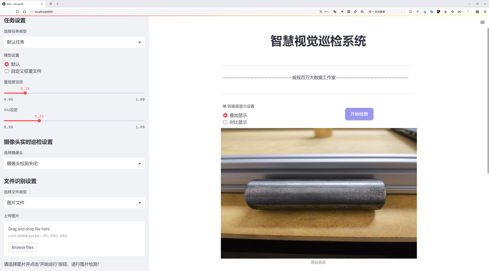
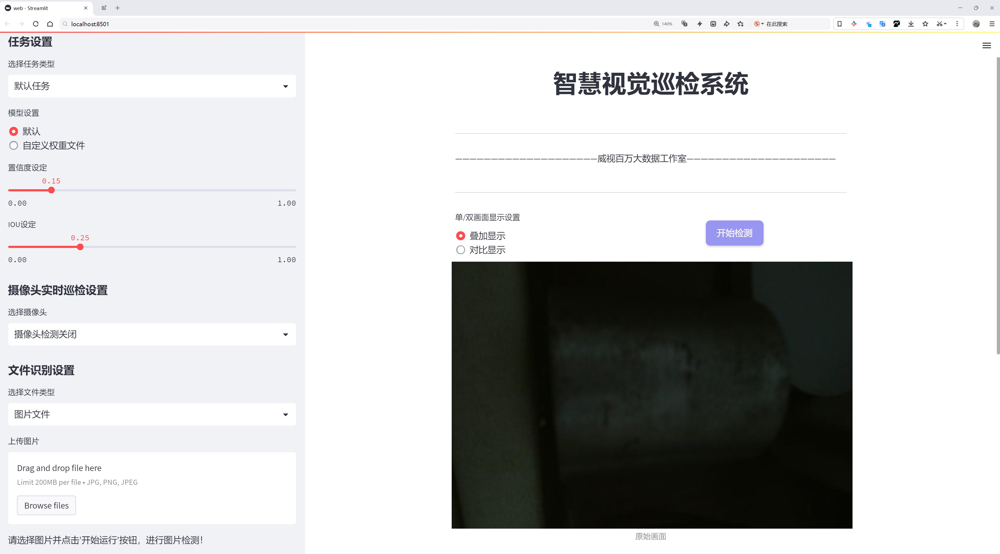
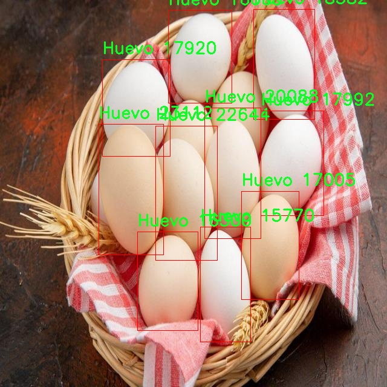
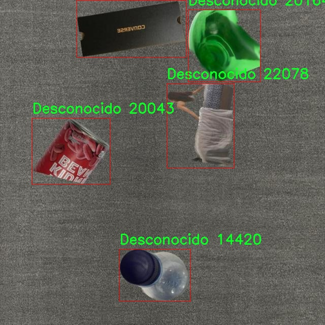
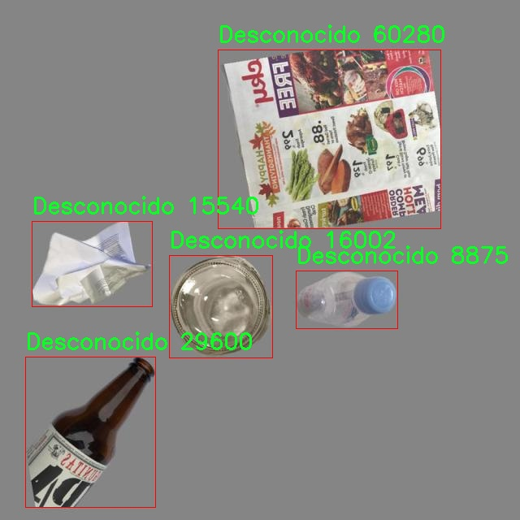
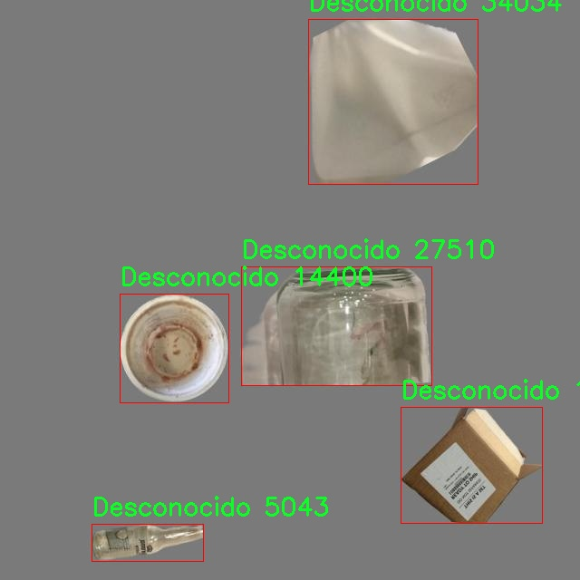

# 金属材质检测检测系统源码分享
 # [一条龙教学YOLOV8标注好的数据集一键训练_70+全套改进创新点发刊_Web前端展示]

### 1.研究背景与意义

项目参考[AAAI Association for the Advancement of Artificial Intelligence](https://gitee.com/qunshansj/projects)

项目来源[AACV Association for the Advancement of Computer Vision](https://gitee.com/qunmasj/projects)

研究背景与意义

随着工业自动化和智能制造的快速发展，金属材质的精确检测在生产过程中的重要性日益凸显。金属材料的种类繁多，包括钢铁、铝、铜等，不同材质的金属在物理和化学性质上存在显著差异，这直接影响到其在各类工业应用中的性能和适用性。因此，如何快速、准确地识别和分类不同金属材质，成为了制造业、回收行业以及材料科学研究等领域亟待解决的关键问题。

近年来，深度学习技术的迅猛发展为物体检测任务提供了新的解决方案。YOLO（You Only Look Once）系列模型因其高效的实时检测能力和较高的准确率，广泛应用于各种物体检测场景。YOLOv8作为该系列的最新版本，进一步提升了模型的性能和适用性。然而，传统YOLO模型在特定领域的应用中，仍然面临着一些挑战，如对复杂背景的适应能力不足、对小物体的检测精度较低等。因此，基于YOLOv8的改进，构建一个专门针对金属材质检测的系统，具有重要的研究意义。

本研究基于一个包含3200张图像的金属材质数据集，涵盖了五种金属类别：钢铁（Acero）、铝（Aluminio）、铜（Bronce）、未知金属（Desconocido）和蛋白质（Huevo）。这些类别的选择不仅反映了工业应用中的常见金属材料，还考虑到了在实际检测中可能遇到的挑战，如未知金属的识别问题。通过对这些数据的深入分析和模型训练，可以为金属材质的快速识别提供有效的解决方案。

本研究的意义在于，首先，提升金属材质检测的准确性和效率，推动工业生产的智能化进程。通过改进YOLOv8模型，使其能够更好地适应金属材质的特征，进而提高检测的准确率，减少人工干预，提高生产效率。其次，研究将为金属回收和再利用提供技术支持。随着资源的日益紧缺，金属回收行业对高效检测技术的需求不断增加，基于深度学习的检测系统能够帮助企业快速识别可回收金属，提高资源利用率，降低环境负担。

此外，本研究还将为相关领域的学术研究提供参考和借鉴。通过对YOLOv8模型的改进及其在金属材质检测中的应用，能够为后续的研究者提供一个有效的框架和思路，推动物体检测技术在其他领域的应用拓展。总之，基于改进YOLOv8的金属材质检测系统的研究，不仅具有重要的理论价值，也将对实际应用产生深远的影响，助力于实现更高效、更智能的工业生产模式。

### 2.图片演示






##### 注意：由于此博客编辑较早，上面“2.图片演示”和“3.视频演示”展示的系统图片或者视频可能为老版本，新版本在老版本的基础上升级如下：（实际效果以升级的新版本为准）

  （1）适配了YOLOV8的“目标检测”模型和“实例分割”模型，通过加载相应的权重（.pt）文件即可自适应加载模型。

  （2）支持“图片识别”、“视频识别”、“摄像头实时识别”三种识别模式。

  （3）支持“图片识别”、“视频识别”、“摄像头实时识别”三种识别结果保存导出，解决手动导出（容易卡顿出现爆内存）存在的问题，识别完自动保存结果并导出到tempDir中。

  （4）支持Web前端系统中的标题、背景图等自定义修改，后面提供修改教程。

  另外本项目提供训练的数据集和训练教程,暂不提供权重文件（best.pt）,需要您按照教程进行训练后实现图片演示和Web前端界面演示的效果。

### 3.视频演示

[3.1 视频演示](https://www.bilibili.com/video/BV1fitoeXEFA/)

### 4.数据集信息展示

##### 4.1 本项目数据集详细数据（类别数＆类别名）

nc: 5
names: ['Acero', 'Aluminio', 'Bronce', 'Desconocido', 'Huevo']


##### 4.2 本项目数据集信息介绍

数据集信息展示

在现代计算机视觉领域，金属材质的检测与识别是一个重要的研究方向，尤其是在工业自动化和智能制造的背景下。为此，我们构建了一个名为“MetalCilinders”的数据集，旨在为改进YOLOv8模型提供高质量的训练数据，以实现对不同金属材质的精准识别和分类。该数据集包含五个主要类别，分别是“Acero”（钢）、“Aluminio”（铝）、“Bronce”（铜）、“Desconocido”（未知）和“Huevo”（蛋白质材料），每个类别都代表了特定的金属特性和应用场景。

“MetalCilinders”数据集的设计充分考虑了实际应用中的多样性和复杂性。每个类别的样本均来自真实的工业环境，确保了数据的真实性和代表性。在数据采集过程中，我们采用了高分辨率的图像捕捉技术，以便在不同的光照条件和背景下获取清晰的金属材质图像。这种方法不仅提高了数据集的质量，也为后续的模型训练提供了丰富的特征信息。

在数据集的构建过程中，我们特别关注了样本的均衡性。每个类别的样本数量经过精心设计，以避免在训练过程中出现类别不平衡的问题。这种均衡性使得模型在学习过程中能够充分理解每种金属材质的特征，从而提高其在实际应用中的泛化能力。尤其是在工业生产中，金属材质的识别往往需要在短时间内做出准确判断，因此数据集的设计也考虑到了实时性和高效性。

此外，为了增强模型的鲁棒性，我们在数据集中引入了多种数据增强技术。这些技术包括随机旋转、缩放、翻转和颜色变换等，旨在模拟不同的拍摄条件和环境变化。通过这些数据增强手段，我们不仅丰富了数据集的多样性，还提高了模型对噪声和干扰的抵抗能力，使其在实际应用中能够更好地适应各种复杂情况。

在“MetalCilinders”数据集中，除了基础的图像数据外，我们还附加了每个样本的详细标签信息，包括金属材质的具体特征、应用场景及其潜在的工业用途。这些信息将为研究人员和工程师提供更深入的理解，帮助他们在实际应用中做出更为精准的决策。

总之，“MetalCilinders”数据集的构建不仅为YOLOv8模型的训练提供了丰富的素材，也为金属材质检测领域的研究提供了坚实的基础。通过对不同金属材质的精准识别，我们希望能够推动智能制造和工业自动化的发展，提升生产效率和产品质量。随着技术的不断进步，我们期待“MetalCilinders”数据集能够为更多的研究和应用提供支持，助力于金属材质检测技术的不断创新与发展。










### 5.全套项目环境部署视频教程（零基础手把手教学）

[5.1 环境部署教程链接（零基础手把手教学）](https://www.ixigua.com/7404473917358506534?logTag=c807d0cbc21c0ef59de5)


[5.2 安装Python虚拟环境创建和依赖库安装视频教程链接（零基础手把手教学）](https://www.ixigua.com/7404474678003106304?logTag=1f1041108cd1f708b01a)

### 6.手把手YOLOV8训练视频教程（零基础小白有手就能学会）

[6.1 手把手YOLOV8训练视频教程（零基础小白有手就能学会）](https://www.ixigua.com/7404477157818401292?logTag=d31a2dfd1983c9668658)

### 7.70+种全套YOLOV8创新点代码加载调参视频教程（一键加载写好的改进模型的配置文件）

[7.1 70+种全套YOLOV8创新点代码加载调参视频教程（一键加载写好的改进模型的配置文件）](https://www.ixigua.com/7404478314661806627?logTag=29066f8288e3f4eea3a4)

### 8.70+种全套YOLOV8创新点原理讲解（非科班也可以轻松写刊发刊，V10版本正在科研待更新）

由于篇幅限制，每个创新点的具体原理讲解就不一一展开，具体见下列网址中的创新点对应子项目的技术原理博客网址【Blog】：


[8.1 70+种全套YOLOV8创新点原理讲解链接](https://gitee.com/qunmasj/good)

### 9.系统功能展示（检测对象为举例，实际内容以本项目数据集为准）

图9.1.系统支持检测结果表格显示

  图9.2.系统支持置信度和IOU阈值手动调节

  图9.3.系统支持自定义加载权重文件best.pt(需要你通过步骤5中训练获得)

  图9.4.系统支持摄像头实时识别

  图9.5.系统支持图片识别

  图9.6.系统支持视频识别

  图9.7.系统支持识别结果文件自动保存

  图9.8.系统支持Excel导出检测结果数据


### 10.原始YOLOV8算法原理

原始YOLOv8算法原理

YOLOv8算法是由Ultralytics公司于2023年发布的最新目标检测算法，作为YOLO系列的延续，它在YOLOv5和YOLOv7的基础上进行了多项创新和改进，尤其在模型结构、特征提取和损失函数等方面表现出色。YOLOv8n是该系列中最轻量化的版本，专为实时检测任务而设计，具有更高的检测精度和更快的推理速度。

在YOLOv8的架构中，输入层、主干网络、特征融合层和解耦头构成了整个网络的基本框架。输入层负责将图像数据转换为统一的640x640 RGB格式，以便后续处理。主干网络采用了CSP结构，通过将特征提取过程分为两个部分，分别进行卷积和连接，从而有效地提取图像特征。C2f模块的引入替代了YOLOv5中的C3模块，C2f模块通过引入ELAN思想，增强了特征的梯度流动，使得模型在深层次上更易于训练和收敛。该模块由多个CBS（卷积+归一化+SiLU激活）构成，并结合了多个Bottleneck结构，使得特征提取的丰富性得以提升。

YOLOv8的颈部网络采用了PAN-FPN结构，这一结构通过自下而上的特征融合，能够充分利用不同层次的特征信息。PAN-FPN的设计允许高层特征与中层和浅层特征进行有效结合，确保了多尺度信息的融合，从而提升了目标检测的准确性。在这一过程中，YOLOv8去除了YOLOv5中上采样阶段的1x1卷积，简化了网络结构，提高了计算效率。

在检测网络方面，YOLOv8摒弃了传统的Anchor-Base检测方式，转而采用Anchor-Free的思想。这一转变使得模型在处理不同尺寸和形状的目标时更加灵活，避免了锚框设计带来的复杂性。YOLOv8的Detect模块使用了解耦头结构，将分类和回归任务分开处理，从而提高了模型的收敛速度和检测精度。解耦头的设计灵活地适应了不同任务的需求，使得分类和定位任务能够独立优化。

损失函数方面，YOLOv8引入了VFLLoss作为分类损失，同时结合DFLLoss和CIoULoss来优化边框回归。这种损失函数的组合不仅提高了模型对难以分类样本的敏感性，还有效地解决了样本不平衡的问题。通过动态调整损失函数的权重，YOLOv8能够在训练过程中更好地平衡正负样本，从而提升整体检测性能。

在数据预处理阶段，YOLOv8延续了YOLOv5的策略，采用了多种数据增强手段，如马赛克增强、混合增强、空间扰动和颜色扰动等。这些增强方法有效地提升了模型的鲁棒性和泛化能力，使得YOLOv8在面对复杂背景和多样化目标时，依然能够保持较高的检测精度。

值得一提的是，YOLOv8在训练过程中对Mosaic数据增强的使用进行了调整，特别是在训练的最后10个epoch中停止使用这一增强方法，以避免对数据真实分布的破坏。这一策略的实施使得模型在后期训练中能够更好地学习到真实场景中的特征，从而提高检测的准确性。

总体而言，YOLOv8在目标检测领域展现出了强大的能力，其结构设计和算法创新使得该模型在精度和速度上均有显著提升。通过C2f模块、PAN-FPN结构、Anchor-Free检测方式和改进的损失函数，YOLOv8能够在各种复杂场景中实现高效的目标检测。随着YOLOv8的发布，目标检测技术的应用范围将进一步扩大，尤其是在实时性要求较高的任务中，YOLOv8无疑将成为一个重要的选择。


### 11.项目核心源码讲解（再也不用担心看不懂代码逻辑）

#### 11.1 ui.py

以下是经过简化和注释的核心代码部分：

```python
import sys
import subprocess
from QtFusion.path import abs_path

def run_script(script_path):
    """
    使用当前 Python 环境运行指定的脚本。

    Args:
        script_path (str): 要运行的脚本路径
    """
    # 获取当前 Python 解释器的路径
    python_path = sys.executable

    # 构建运行命令，使用 streamlit 运行指定的脚本
    command = f'"{python_path}" -m streamlit run "{script_path}"'

    # 执行命令并获取结果
    result = subprocess.run(command, shell=True)
    
    # 检查命令执行是否成功
    if result.returncode != 0:
        print("脚本运行出错。")

# 主程序入口
if __name__ == "__main__":
    # 获取脚本的绝对路径
    script_path = abs_path("web.py")

    # 运行指定的脚本
    run_script(script_path)
```

### 代码注释说明：
1. **导入模块**：
   - `sys`：用于获取当前 Python 解释器的路径。
   - `subprocess`：用于执行外部命令。
   - `abs_path`：从 `QtFusion.path` 模块导入，用于获取文件的绝对路径。

2. **`run_script` 函数**：
   - 接受一个参数 `script_path`，表示要运行的 Python 脚本的路径。
   - 使用 `sys.executable` 获取当前 Python 解释器的路径。
   - 构建一个命令字符串，用于运行 `streamlit` 应用。
   - 使用 `subprocess.run` 执行构建的命令，并检查返回值以确定命令是否成功执行。

3. **主程序入口**：
   - 在 `__main__` 块中，调用 `abs_path` 函数获取 `web.py` 的绝对路径。
   - 调用 `run_script` 函数来运行指定的脚本。

这个文件名为 `ui.py`，它的主要功能是运行一个指定的 Python 脚本，具体来说是使用 Streamlit 框架来启动一个 Web 应用。

首先，文件中导入了一些必要的模块，包括 `sys`、`os` 和 `subprocess`。`sys` 模块用于访问与 Python 解释器紧密相关的变量和函数，`os` 模块提供了与操作系统交互的功能，而 `subprocess` 模块则用于生成新的进程、连接到它们的输入/输出/错误管道，并获取它们的返回码。

接下来，定义了一个名为 `run_script` 的函数，该函数接受一个参数 `script_path`，表示要运行的脚本的路径。在函数内部，首先获取当前 Python 解释器的路径，这通过 `sys.executable` 实现。然后，构建一个命令字符串，该命令使用当前的 Python 解释器和 Streamlit 模块来运行指定的脚本。具体的命令格式为 `"{python_path}" -m streamlit run "{script_path}"`。

接着，使用 `subprocess.run` 方法执行这个命令。这个方法会在新的进程中运行命令，并等待其完成。如果命令执行的返回码不为零，表示脚本运行出错，此时会打印出一条错误信息。

在文件的最后部分，使用 `if __name__ == "__main__":` 语句来确保只有在直接运行该脚本时才会执行以下代码。这部分代码指定了要运行的脚本路径，这里是通过调用 `abs_path("web.py")` 来获取的，`abs_path` 函数的作用是将相对路径转换为绝对路径。最后，调用 `run_script` 函数来运行指定的脚本。

总体来说，这个文件的作用是通过当前的 Python 环境来启动一个 Streamlit Web 应用，便于用户在本地运行和测试 Web 应用。

#### 11.2 code\ultralytics\utils\downloads.py

以下是代码中最核心的部分，并附上详细的中文注释：

```python
import requests
from pathlib import Path
from zipfile import ZipFile, is_zipfile
from ultralytics.utils import LOGGER, TQDM

def safe_download(
    url,
    file=None,
    dir=None,
    unzip=True,
    delete=False,
    retry=3,
    min_bytes=1e0,
    exist_ok=False,
    progress=True,
):
    """
    从指定的URL下载文件，并提供重试、解压和删除下载文件的选项。

    参数:
        url (str): 要下载的文件的URL。
        file (str, optional): 下载文件的文件名。如果未提供，将使用URL中的文件名。
        dir (str, optional): 保存下载文件的目录。如果未提供，将在当前工作目录中保存文件。
        unzip (bool, optional): 是否在下载后解压文件。默认值为True。
        delete (bool, optional): 是否在解压后删除下载的文件。默认值为False。
        retry (int, optional): 下载失败时重试的次数。默认值为3。
        min_bytes (float, optional): 下载文件成功的最小字节数。默认值为1E0。
        exist_ok (bool, optional): 解压时是否覆盖现有内容。默认值为False。
        progress (bool, optional): 下载过程中是否显示进度条。默认值为True。

    返回:
        (Path): 解压后的目录路径。
    """
    f = Path(dir or ".") / (file or url2file(url))  # 生成下载文件的完整路径
    if not f.is_file():  # 如果文件不存在
        desc = f"Downloading {url} to '{f}'"
        LOGGER.info(f"{desc}...")  # 记录下载信息
        f.parent.mkdir(parents=True, exist_ok=True)  # 创建目录
        for i in range(retry + 1):  # 尝试下载
            try:
                response = requests.get(url, stream=True)  # 发起下载请求
                response.raise_for_status()  # 检查请求是否成功
                with open(f, "wb") as f_opened:
                    for data in response.iter_content(chunk_size=8192):  # 分块写入文件
                        f_opened.write(data)
                if f.exists() and f.stat().st_size > min_bytes:  # 检查文件大小
                    break  # 下载成功
                f.unlink()  # 删除部分下载的文件
            except Exception as e:
                if i >= retry:
                    raise ConnectionError(f"下载失败: {url}") from e  # 超过重试次数，抛出异常

    if unzip and f.exists() and f.suffix in (".zip", ".tar", ".gz"):  # 如果需要解压
        unzip_dir = (dir or f.parent).resolve()  # 解压目录
        if is_zipfile(f):
            with ZipFile(f) as zipObj:
                zipObj.extractall(unzip_dir)  # 解压文件
        if delete:
            f.unlink()  # 删除压缩文件
        return unzip_dir  # 返回解压后的目录路径
```

### 代码核心部分解释：
1. **导入必要的库**：使用`requests`库进行网络请求，`pathlib`处理文件路径，`zipfile`处理压缩文件，`LOGGER`用于记录日志，`TQDM`用于显示进度条。

2. **`safe_download`函数**：该函数负责从指定的URL下载文件，并提供了多种选项以满足不同需求，如重试机制、解压缩和删除下载文件等。

3. **参数说明**：
   - `url`：下载文件的URL。
   - `file`：指定下载后的文件名。
   - `dir`：指定保存文件的目录。
   - `unzip`：是否在下载后自动解压。
   - `delete`：是否在解压后删除压缩文件。
   - `retry`：下载失败时的重试次数。
   - `min_bytes`：成功下载的文件大小阈值。
   - `exist_ok`：解压时是否覆盖现有文件。
   - `progress`：是否显示下载进度。

4. **下载逻辑**：
   - 生成下载文件的完整路径，如果文件不存在则开始下载。
   - 使用`requests.get`发起下载请求，并逐块写入文件。
   - 检查文件是否成功下载（通过文件大小判断），如果下载失败则重试。

5. **解压逻辑**：
   - 如果需要解压且文件存在且是压缩文件，则进行解压。
   - 根据文件类型（zip、tar、gz）进行相应的解压操作。
   - 根据`delete`参数决定是否删除压缩文件。

这个函数是下载和处理文件的核心部分，能够灵活应对多种情况。

这个程序文件 `downloads.py` 是 Ultralytics YOLO 项目的一部分，主要用于处理文件的下载、解压和管理。文件中包含多个函数，提供了多种功能以便于用户从网络上获取模型权重和其他资源。

首先，文件导入了一些必要的库，包括处理文件路径的 `Path`、进行网络请求的 `requests`、以及用于多线程下载的 `ThreadPool`。它还定义了一些常量，如 GitHub 上的资源名称和文件名，这些资源主要是 YOLO 模型的权重文件。

文件中定义的 `is_url` 函数用于验证给定字符串是否为有效的 URL，并可选择性地检查该 URL 是否在线。它通过解析 URL 并发送请求来确认其有效性。

`delete_dsstore` 函数用于删除指定目录下的 `.DS_Store` 文件，这些文件是 macOS 系统生成的隐藏文件，可能在不同操作系统之间传输时造成问题。

`zip_directory` 和 `unzip_file` 函数分别用于压缩和解压缩目录。压缩时会排除特定的文件，解压缩时则会根据 ZIP 文件的结构决定提取路径，并且可以选择性地覆盖已存在的文件。

`check_disk_space` 函数用于检查系统中是否有足够的磁盘空间来下载文件。它会计算所需的空间和当前可用空间，并根据设定的安全因子判断是否可以继续下载。

`get_google_drive_file_info` 函数用于从 Google Drive 的分享链接中提取直接下载链接和文件名，处理 Google Drive 特有的下载限制。

`safe_download` 函数是核心下载功能，支持从 URL 下载文件，支持重试机制、解压缩、删除下载文件等选项。它能够处理 Google Drive 链接，并在下载过程中显示进度条。

`get_github_assets` 函数用于从指定的 GitHub 仓库获取发布版本的标签和资源列表。它会处理请求失败的情况，并在必要时重试。

`attempt_download_asset` 函数尝试从 GitHub 下载指定的文件，如果本地找不到该文件，则会从 GitHub 的发布资源中下载。

最后，`download` 函数支持从一个或多个 URL 下载文件，允许并发下载，并在下载完成后进行解压缩和清理。

总体而言，这个文件提供了一整套用于文件下载和管理的工具，适用于需要从网络获取和处理模型权重或其他资源的场景。

#### 11.3 70+种YOLOv8算法改进源码大全和调试加载训练教程（非必要）\ultralytics\hub\utils.py

以下是代码中最核心的部分，并附上详细的中文注释：

```python
import requests
import threading
import time
from ultralytics.utils import TQDM, TryExcept, __version__, ENVIRONMENT, SETTINGS, ONLINE

def requests_with_progress(method, url, **kwargs):
    """
    使用指定的方法和URL进行HTTP请求，并可选地显示进度条。

    参数:
        method (str): 要使用的HTTP方法（例如 'GET', 'POST'）。
        url (str): 要发送请求的URL。
        **kwargs (dict): 传递给底层 `requests.request` 函数的其他关键字参数。

    返回:
        (requests.Response): HTTP请求的响应对象。
    """
    progress = kwargs.pop('progress', False)  # 从kwargs中获取进度参数
    if not progress:
        return requests.request(method, url, **kwargs)  # 如果没有进度，直接发送请求

    # 否则，使用流式请求以显示进度
    response = requests.request(method, url, stream=True, **kwargs)
    total = int(response.headers.get('content-length', 0))  # 获取响应的总大小
    try:
        pbar = TQDM(total=total, unit='B', unit_scale=True, unit_divisor=1024)  # 初始化进度条
        for data in response.iter_content(chunk_size=1024):  # 分块读取响应内容
            pbar.update(len(data))  # 更新进度条
        pbar.close()  # 关闭进度条
    except requests.exceptions.ChunkedEncodingError:  # 处理连接中断的异常
        response.close()  # 关闭响应
    return response  # 返回响应对象

def smart_request(method, url, retry=3, timeout=30, thread=True, verbose=True, progress=False, **kwargs):
    """
    使用'requests'库进行HTTP请求，支持重试和超时。

    参数:
        method (str): 请求使用的HTTP方法。
        url (str): 要请求的URL。
        retry (int, optional): 放弃之前的重试次数，默认为3。
        timeout (int, optional): 超时时间（秒），默认为30。
        thread (bool, optional): 是否在单独的线程中执行请求，默认为True。
        verbose (bool, optional): 是否在控制台打印输出，默认为True。
        progress (bool, optional): 是否在请求期间显示进度条，默认为False。
        **kwargs (dict): 传递给请求函数的关键字参数。

    返回:
        (requests.Response): HTTP响应对象。如果请求在单独线程中执行，则返回None。
    """
    retry_codes = (408, 500)  # 仅对这些状态码进行重试

    @TryExcept(verbose=verbose)
    def func(func_method, func_url, **func_kwargs):
        """执行带有重试和超时的HTTP请求，支持进度跟踪。"""
        r = None  # 响应对象
        t0 = time.time()  # 记录开始时间
        for i in range(retry + 1):
            if (time.time() - t0) > timeout:  # 超过超时时间则停止重试
                break
            r = requests_with_progress(func_method, func_url, **func_kwargs)  # 发送请求
            if r.status_code < 300:  # 如果状态码在2xx范围内，表示成功
                break
            # 处理错误信息
            if i == 0 and r.status_code in retry_codes:
                LOGGER.warning(f'请求失败，正在重试 {retry} 次。状态码: {r.status_code}')
            time.sleep(2 ** i)  # 指数退避
        return r  # 返回响应对象

    args = method, url
    kwargs['progress'] = progress  # 将进度参数传递给函数
    if thread:
        threading.Thread(target=func, args=args, kwargs=kwargs, daemon=True).start()  # 在新线程中执行
    else:
        return func(*args, **kwargs)  # 直接执行请求

class Events:
    """
    用于收集匿名事件分析的类。事件分析在设置中sync=True时启用，sync=False时禁用。

    属性:
        url (str): 发送匿名事件的URL。
        rate_limit (float): 发送事件的速率限制（秒）。
        metadata (dict): 包含环境元数据的字典。
        enabled (bool): 根据某些条件启用或禁用事件。
    """
    url = 'https://www.google-analytics.com/mp/collect?measurement_id=G-X8NCJYTQXM&api_secret=QLQrATrNSwGRFRLE-cbHJw'

    def __init__(self):
        """初始化Events对象，设置默认值。"""
        self.events = []  # 事件列表
        self.rate_limit = 60.0  # 速率限制（秒）
        self.t = 0.0  # 速率限制计时器（秒）
        self.metadata = {
            'version': __version__,
            'env': ENVIRONMENT,
            'session_id': round(random.random() * 1E15)}  # 其他元数据
        self.enabled = SETTINGS['sync'] and ONLINE  # 根据设置和在线状态确定是否启用

    def __call__(self, cfg):
        """
        尝试将新事件添加到事件列表，并在达到速率限制时发送事件。

        参数:
            cfg (IterableSimpleNamespace): 包含模式和任务信息的配置对象。
        """
        if not self.enabled:
            return  # 如果事件禁用，则不执行任何操作

        # 尝试添加事件
        if len(self.events) < 25:  # 事件列表限制为25个事件
            params = {'task': cfg.task, 'model': cfg.model}
            self.events.append({'name': cfg.mode, 'params': params})

        # 检查速率限制
        t = time.time()
        if (t - self.t) < self.rate_limit:
            return  # 如果在速率限制内，则不发送

        # 超过速率限制，发送事件
        data = {'client_id': SETTINGS['uuid'], 'events': self.events}  # 包含事件的POST数据
        smart_request('post', self.url, json=data, retry=0, verbose=False)  # 发送事件

        # 重置事件和速率限制计时器
        self.events = []
        self.t = t

# 初始化事件收集器
events = Events()
```

### 代码核心部分说明：
1. **requests_with_progress**: 这个函数用于发送HTTP请求，并在下载时显示进度条。它支持流式读取响应内容，以便在下载大文件时提供反馈。

2. **smart_request**: 这个函数封装了HTTP请求的逻辑，支持重试机制和超时控制。它使用指数退避策略来处理请求失败的情况。

3. **Events类**: 这个类用于收集和发送匿名事件分析数据。它根据配置和环境条件决定是否启用事件收集，并管理事件的发送频率。

这个程序文件是Ultralytics YOLO的一个工具模块，主要用于处理与Ultralytics Hub相关的网络请求和事件分析。代码中导入了一些必要的库和模块，包括操作系统、平台、随机数、线程、时间等，此外还导入了Ultralytics库中的一些工具函数和常量。

首先，文件定义了一些常量，比如`HUB_API_ROOT`和`HUB_WEB_ROOT`，它们分别表示Ultralytics Hub的API和Web根地址。接着，定义了一个函数`request_with_credentials`，该函数用于在Google Colab环境中进行带有凭证的AJAX请求。如果该函数在非Colab环境中调用，会抛出一个OSError异常。

接下来，`requests_with_progress`函数用于发起HTTP请求，并在下载过程中显示进度条。这个函数支持可选的进度条功能，能够在请求过程中实时更新下载进度。

然后，`smart_request`函数实现了带有重试机制的HTTP请求。它会在请求失败时进行指数退避重试，最多重试指定次数。该函数还支持在单独的线程中执行请求，以避免阻塞主线程。

接下来是`Events`类，它用于收集匿名事件分析数据。这个类在初始化时设置了一些默认值，包括事件列表、速率限制、元数据等。事件的发送是基于一定的条件，比如同步设置、运行状态、在线状态等。`__call__`方法尝试将新事件添加到事件列表中，并在达到速率限制时发送事件数据。

最后，代码的底部创建了一个`Events`类的实例，名为`events`，用于在后续的操作中收集和发送事件数据。整个模块的设计旨在增强Ultralytics YOLO的功能，特别是在数据收集和网络请求方面，使得用户能够更方便地与Ultralytics Hub进行交互。

#### 11.4 train.py

以下是经过简化和注释的核心代码部分，主要保留了与YOLO目标检测训练相关的功能：

```python
import random
import numpy as np
import torch.nn as nn
from ultralytics.data import build_dataloader, build_yolo_dataset
from ultralytics.engine.trainer import BaseTrainer
from ultralytics.models import yolo
from ultralytics.nn.tasks import DetectionModel
from ultralytics.utils import LOGGER, RANK
from ultralytics.utils.torch_utils import de_parallel, torch_distributed_zero_first

class DetectionTrainer(BaseTrainer):
    """
    基于YOLO模型的目标检测训练类，继承自BaseTrainer。
    """

    def build_dataset(self, img_path, mode="train", batch=None):
        """
        构建YOLO数据集。

        参数:
            img_path (str): 图像文件夹的路径。
            mode (str): 模式，可以是'train'或'val'，用于不同的数据增强。
            batch (int, optional): 批次大小，仅用于'rect'模式。默认为None。
        """
        gs = max(int(de_parallel(self.model).stride.max() if self.model else 0), 32)  # 获取模型的最大步幅
        return build_yolo_dataset(self.args, img_path, batch, self.data, mode=mode, rect=mode == "val", stride=gs)

    def get_dataloader(self, dataset_path, batch_size=16, rank=0, mode="train"):
        """构建并返回数据加载器。"""
        assert mode in ["train", "val"]  # 确保模式有效
        with torch_distributed_zero_first(rank):  # 仅在DDP情况下初始化数据集
            dataset = self.build_dataset(dataset_path, mode, batch_size)
        shuffle = mode == "train"  # 训练模式下打乱数据
        workers = self.args.workers if mode == "train" else self.args.workers * 2  # 根据模式设置工作线程数
        return build_dataloader(dataset, batch_size, workers, shuffle, rank)  # 返回数据加载器

    def preprocess_batch(self, batch):
        """对图像批次进行预处理，包括缩放和转换为浮点数。"""
        batch["img"] = batch["img"].to(self.device, non_blocking=True).float() / 255  # 将图像转换为浮点数并归一化
        if self.args.multi_scale:  # 如果启用多尺度
            imgs = batch["img"]
            sz = (
                random.randrange(self.args.imgsz * 0.5, self.args.imgsz * 1.5 + self.stride)
                // self.stride
                * self.stride
            )  # 随机选择新的尺寸
            sf = sz / max(imgs.shape[2:])  # 计算缩放因子
            if sf != 1:
                ns = [
                    math.ceil(x * sf / self.stride) * self.stride for x in imgs.shape[2:]
                ]  # 计算新的形状
                imgs = nn.functional.interpolate(imgs, size=ns, mode="bilinear", align_corners=False)  # 进行插值
            batch["img"] = imgs  # 更新批次图像
        return batch

    def get_model(self, cfg=None, weights=None, verbose=True):
        """返回YOLO目标检测模型。"""
        model = DetectionModel(cfg, nc=self.data["nc"], verbose=verbose and RANK == -1)  # 创建检测模型
        if weights:
            model.load(weights)  # 加载权重
        return model

    def plot_training_samples(self, batch, ni):
        """绘制训练样本及其标注。"""
        plot_images(
            images=batch["img"],
            batch_idx=batch["batch_idx"],
            cls=batch["cls"].squeeze(-1),
            bboxes=batch["bboxes"],
            paths=batch["im_file"],
            fname=self.save_dir / f"train_batch{ni}.jpg",
            on_plot=self.on_plot,
        )

    def plot_metrics(self):
        """从CSV文件中绘制指标。"""
        plot_results(file=self.csv, on_plot=self.on_plot)  # 保存结果图
```

### 代码说明：
1. **DetectionTrainer类**：继承自`BaseTrainer`，用于实现YOLO模型的训练。
2. **build_dataset方法**：根据输入路径和模式构建YOLO数据集，支持训练和验证模式。
3. **get_dataloader方法**：构建数据加载器，支持多线程和数据打乱。
4. **preprocess_batch方法**：对输入的图像批次进行预处理，包括归一化和多尺度调整。
5. **get_model方法**：创建并返回YOLO目标检测模型，可以选择加载预训练权重。
6. **plot_training_samples方法**：绘制训练样本及其对应的标注，便于可视化训练效果。
7. **plot_metrics方法**：从CSV文件中读取并绘制训练过程中的指标，便于分析模型性能。

这个程序文件 `train.py` 是一个用于训练 YOLO（You Only Look Once）目标检测模型的脚本，继承自 `BaseTrainer` 类。它的主要功能是构建数据集、创建数据加载器、预处理图像、设置模型属性、获取模型、进行验证、记录损失、输出训练进度、绘制训练样本和绘制训练指标等。

在 `DetectionTrainer` 类中，首先定义了一个构造函数，允许用户通过参数传递模型配置、数据集路径和训练周期等信息。`build_dataset` 方法用于构建 YOLO 数据集，支持训练和验证模式，允许用户为不同模式自定义数据增强。

`get_dataloader` 方法构建并返回数据加载器，确保在分布式训练中只初始化一次数据集。它会根据模式决定是否打乱数据，并设置工作线程的数量。`preprocess_batch` 方法负责对输入的图像批次进行预处理，包括缩放和转换为浮点数格式。

`set_model_attributes` 方法用于设置模型的属性，包括类别数量和类别名称等。`get_model` 方法返回一个 YOLO 检测模型，并可选择加载预训练权重。`get_validator` 方法返回一个用于模型验证的验证器。

`label_loss_items` 方法用于返回带有标签的训练损失项字典，以便于监控训练过程中的损失情况。`progress_string` 方法返回一个格式化的字符串，显示训练进度，包括当前周期、GPU 内存使用情况、损失值、实例数量和图像大小等信息。

`plot_training_samples` 方法用于绘制训练样本及其标注，便于可视化训练数据。最后，`plot_metrics` 和 `plot_training_labels` 方法分别用于绘制训练指标和创建带标签的训练图，以帮助用户分析模型的训练效果。

整体来看，这个文件提供了一整套用于训练 YOLO 模型的功能，涵盖了从数据准备到模型训练和验证的各个方面，便于用户快速上手进行目标检测任务。

#### 11.5 code\ultralytics\models\yolo\classify\__init__.py

以下是保留的核心代码部分，并添加了详细的中文注释：

```python
# 导入Ultralytics YOLO库中的分类预测、训练和验证模块
from ultralytics.models.yolo.classify.predict import ClassificationPredictor  # 导入分类预测器
from ultralytics.models.yolo.classify.train import ClassificationTrainer      # 导入分类训练器
from ultralytics.models.yolo.classify.val import ClassificationValidator      # 导入分类验证器

# 定义模块的公开接口，指定可以被外部访问的类
__all__ = "ClassificationPredictor", "ClassificationTrainer", "ClassificationValidator"
```

### 注释说明：
1. **导入模块**：
   - `ClassificationPredictor`：用于进行分类预测的类，负责输入数据并输出分类结果。
   - `ClassificationTrainer`：用于训练分类模型的类，负责模型的训练过程，包括数据加载、模型优化等。
   - `ClassificationValidator`：用于验证分类模型性能的类，负责评估模型在验证集上的表现。

2. **`__all__`**：
   - 这是一个特殊的变量，用于定义当使用 `from module import *` 语句时，哪些名称会被导入。这里指定了三个类，使得它们可以被外部模块访问。

这个程序文件是一个Python模块的初始化文件，位于Ultralytics YOLO项目的分类子模块中。文件的主要功能是导入和定义该模块中可用的类或函数，以便其他模块能够方便地使用。

首先，文件开头的注释部分标明了该项目的名称“Ultralytics YOLO”以及其使用的许可证类型（AGPL-3.0）。这表明该项目是开源的，并且遵循特定的许可证条款。

接下来，文件通过`from ... import ...`语句导入了三个类：`ClassificationPredictor`、`ClassificationTrainer`和`ClassificationValidator`。这些类分别用于分类任务中的预测、训练和验证功能。具体来说：

- `ClassificationPredictor`类可能用于加载训练好的模型并对新数据进行分类预测。
- `ClassificationTrainer`类用于执行模型的训练过程，包括数据加载、模型优化等。
- `ClassificationValidator`类则用于在训练后对模型进行验证，以评估其性能。

最后，`__all__`变量定义了该模块的公共接口，列出了可以被外部访问的类名。这意味着当其他模块使用`from ultralytics.models.yolo.classify import *`时，只会导入`ClassificationPredictor`、`ClassificationTrainer`和`ClassificationValidator`这三个类。

总的来说，这个初始化文件的作用是组织和简化分类模块的使用，使得用户能够方便地导入和使用相关的功能类。

#### 11.6 code\ultralytics\utils\checks.py

以下是经过简化和注释的核心代码部分，主要保留了与检查和验证相关的功能：

```python
import os
import re
import subprocess
from pathlib import Path
from typing import Optional
import torch
from ultralytics.utils import LOGGER, ROOT, metadata

def parse_requirements(file_path=ROOT.parent / "requirements.txt", package=""):
    """
    解析 requirements.txt 文件，忽略以 '#' 开头的行和 '#' 后的文本。

    参数:
        file_path (Path): requirements.txt 文件的路径。
        package (str, optional): 使用的 Python 包名，默认为空。

    返回:
        (List[Dict[str, str]]): 解析后的需求列表，每个需求以字典形式表示，包含 `name` 和 `specifier` 键。
    """
    if package:
        # 获取指定包的依赖
        requires = [x for x in metadata.distribution(package).requires if "extra == " not in x]
    else:
        # 从文件中读取依赖
        requires = Path(file_path).read_text().splitlines()

    requirements = []
    for line in requires:
        line = line.strip()
        if line and not line.startswith("#"):
            line = line.split("#")[0].strip()  # 忽略行内注释
            match = re.match(r"([a-zA-Z0-9-_]+)\s*([<>!=~]+.*)?", line)
            if match:
                requirements.append(SimpleNamespace(name=match[1], specifier=match[2].strip() if match[2] else ""))
    return requirements

def check_version(current: str = "0.0.0", required: str = "0.0.0", name: str = "version", hard: bool = False) -> bool:
    """
    检查当前版本是否满足要求的版本或范围。

    参数:
        current (str): 当前版本。
        required (str): 要求的版本或范围（以 pip 风格格式）。
        name (str, optional): 用于警告消息的名称。
        hard (bool, optional): 如果为 True，当不满足要求时抛出 AssertionError。

    返回:
        (bool): 如果满足要求则返回 True，否则返回 False。
    """
    if not current:  # 如果当前版本为空
        LOGGER.warning(f"WARNING ⚠️ invalid check_version({current}, {required}) requested, please check values.")
        return True

    # 解析当前版本
    c = parse_version(current)  # 将版本字符串转换为元组
    for r in required.strip(",").split(","):
        op, version = re.match(r"([^0-9]*)([\d.]+)", r).groups()  # 分离操作符和版本号
        v = parse_version(version)  # 将版本字符串转换为元组
        # 根据操作符检查版本
        if op == "==" and c != v:
            return False
        elif op == "!=" and c == v:
            return False
        elif op in (">=", "") and not (c >= v):
            return False
        elif op == "<=" and not (c <= v):
            return False
        elif op == ">" and not (c > v):
            return False
        elif op == "<" and not (c < v):
            return False

    return True

def check_python(minimum: str = "3.8.0") -> bool:
    """
    检查当前 Python 版本是否满足要求的最低版本。

    参数:
        minimum (str): 要求的最低 Python 版本。

    返回:
        None
    """
    return check_version(platform.python_version(), minimum, name="Python ", hard=True)

def check_requirements(requirements=ROOT.parent / "requirements.txt", exclude=(), install=True) -> bool:
    """
    检查已安装的依赖项是否满足要求，并尝试自动更新。

    参数:
        requirements (Union[Path, str, List[str]]): requirements.txt 文件的路径，单个包要求的字符串，或包要求的字符串列表。
        exclude (Tuple[str]): 要排除的包名元组。
        install (bool): 如果为 True，尝试自动更新不满足要求的包。

    返回:
        (bool): 如果所有要求都满足则返回 True，否则返回 False。
    """
    check_python()  # 检查 Python 版本
    if isinstance(requirements, Path):  # 如果是 requirements.txt 文件
        file = requirements.resolve()
        assert file.exists(), f"requirements file {file} not found."
        requirements = [f"{x.name}{x.specifier}" for x in parse_requirements(file) if x.name not in exclude]
    elif isinstance(requirements, str):
        requirements = [requirements]

    pkgs = []
    for r in requirements:
        match = re.match(r"([a-zA-Z0-9-_]+)([<>!=~]+.*)?", r)
        name, required = match[1], match[2].strip() if match[2] else ""
        try:
            assert check_version(metadata.version(name), required)  # 检查版本是否满足要求
        except (AssertionError, metadata.PackageNotFoundError):
            pkgs.append(r)

    if pkgs and install:  # 如果有不满足要求的包并且允许安装
        s = " ".join(f'"{x}"' for x in pkgs)  # 生成安装命令
        LOGGER.info(f"Attempting to auto-update packages: {s}")
        subprocess.run(f"pip install --no-cache {s}", shell=True)  # 执行安装命令
        return True

    return not pkgs  # 如果没有不满足要求的包则返回 True
```

### 代码说明：
1. **`parse_requirements`**: 解析给定的 `requirements.txt` 文件，返回包的名称和版本要求。
2. **`check_version`**: 检查当前版本是否满足给定的版本要求。
3. **`check_python`**: 检查当前 Python 版本是否满足最低要求。
4. **`check_requirements`**: 检查依赖项是否满足要求，并尝试自动更新不满足要求的包。

这些函数是用于确保环境中安装的库和工具符合特定的要求，通常在机器学习和深度学习项目中非常重要。

这个程序文件 `checks.py` 是 Ultralytics YOLO 项目的一部分，主要用于检查和验证各种环境配置、依赖关系和版本兼容性，以确保 YOLO 模型能够正确运行。文件中包含多个函数，每个函数负责特定的检查任务。

首先，文件导入了一系列必要的库，包括标准库和第三方库，如 `torch`、`numpy`、`requests` 等。接着，定义了一些常量和工具函数，这些函数在后续的检查中会被调用。

文件中的 `parse_requirements` 函数用于解析 `requirements.txt` 文件，提取出需要的包及其版本要求。它会忽略以 `#` 开头的注释行，并将每一行转换为包含包名和版本规范的字典。

`parse_version` 函数将版本字符串转换为整数元组，方便进行版本比较。`is_ascii` 函数检查字符串是否仅由 ASCII 字符组成。

`check_imgsz` 函数验证图像尺寸是否为给定步幅的倍数，并在必要时进行调整，以确保图像尺寸符合模型的输入要求。

`check_version` 函数用于检查当前版本是否满足所需版本要求，可以根据需要选择是否抛出异常或打印警告信息。

`check_latest_pypi_version` 和 `check_pip_update_available` 函数用于检查 PyPI 上是否有可用的包更新。

`check_font` 函数用于查找本地字体文件，如果找不到则从指定 URL 下载。

`check_python` 函数检查当前 Python 版本是否满足最低要求。

`check_requirements` 函数检查已安装的依赖项是否满足 YOLOv8 的要求，并在需要时尝试自动更新。

`check_torchvision` 函数检查安装的 PyTorch 和 Torchvision 版本是否兼容。

`check_suffix` 和 `check_yaml` 函数用于检查文件后缀和 YAML 文件的有效性。

`check_is_path_safe` 函数确保路径安全，防止路径遍历攻击。

`check_imshow` 函数检查环境是否支持图像显示。

`check_yolo` 和 `collect_system_info` 函数用于收集和打印系统信息，包括操作系统、Python 版本、内存、CPU 和 CUDA 信息。

`check_amp` 函数检查 PyTorch 的自动混合精度功能是否正常工作，以避免在训练过程中出现 NaN 损失或零 mAP 结果。

`git_describe` 函数返回人类可读的 Git 描述信息。

`print_args` 函数用于打印函数参数，便于调试。

`cuda_device_count` 和 `cuda_is_available` 函数用于检查可用的 NVIDIA GPU 数量和 CUDA 是否可用。

整体而言，这个文件通过一系列的检查函数，确保了 YOLO 模型在不同环境下的兼容性和正确性，提供了良好的用户体验。

### 12.系统整体结构（节选）

### 整体功能和构架概括

该项目是一个基于 YOLO（You Only Look Once）目标检测算法的实现，包含了模型训练、验证、推理和数据处理等多个模块。项目结构清晰，功能模块化，便于用户进行目标检测任务的开发和调试。主要包括以下几个方面：

1. **用户界面（UI）**：通过 `ui.py` 和 `ui_style.py` 提供了一个友好的用户界面，方便用户启动和配置模型训练及推理过程。
2. **模型训练与验证**：`train.py` 和 `val.py` 提供了模型的训练和验证功能，支持数据集的加载、模型的构建与优化。
3. **数据处理**：`dataset.py` 和 `downloads.py` 负责数据集的构建和管理，包括数据下载、预处理和增强等。
4. **工具函数**：`checks.py` 和 `utils.py` 提供了一系列实用的工具函数，用于环境检查、依赖管理和系统信息收集等。
5. **分类模块**：`__init__.py` 和其他分类相关文件提供了分类任务的支持，允许用户进行图像分类的训练和推理。
6. **模型组件**：`transformer.py` 和 `decoders.py` 等文件实现了模型的核心组件，支持特定的模型架构和功能。

### 文件功能整理表

| 文件路径                                                                                         | 功能描述                                                                                       |
|--------------------------------------------------------------------------------------------------|-----------------------------------------------------------------------------------------------|
| `D:\tools\20240809\code\ui.py`                                                                  | 提供用户界面，启动和配置模型训练及推理过程。                                                 |
| `D:\tools\20240809\code\code\ultralytics\utils\downloads.py`                                   | 处理文件下载、解压和管理，支持从网络获取模型权重和其他资源。                                 |
| `D:\tools\20240809\code\70+种YOLOv8算法改进源码大全和调试加载训练教程（非必要）\ultralytics\hub\utils.py` | 处理与Ultralytics Hub相关的网络请求和事件分析，支持数据收集和发送。                          |
| `D:\tools\20240809\code\train.py`                                                               | 负责模型的训练过程，包括数据加载、模型优化和训练进度监控。                                  |
| `D:\tools\20240809\code\code\ultralytics\models\yolo\classify\__init__.py`                   | 初始化分类模块，导入分类相关的类和函数。                                                    |
| `D:\tools\20240809\code\code\ultralytics\utils\checks.py`                                     | 检查和验证环境配置、依赖关系和版本兼容性，确保模型能够正确运行。                             |
| `D:\tools\20240809\code\70+种YOLOv8算法改进源码大全和调试加载训练教程（非必要）\ultralytics\hub\auth.py` | 处理与用户认证相关的功能，支持访问Ultralytics Hub的安全请求。                                |
| `D:\tools\20240809\code\70+种YOLOv8算法改进源码大全和调试加载训练教程（非必要）\ultralytics\models\sam\modules\transformer.py` | 实现模型的Transformer模块，支持特定的模型架构。                                             |
| `D:\tools\20240809\code\70+种YOLOv8算法改进源码大全和调试加载训练教程（非必要）\ultralytics\data\dataset.py` | 处理数据集的构建和管理，包括数据加载和预处理。                                              |
| `D:\tools\20240809\code\70+种YOLOv8算法改进源码大全和调试加载训练教程（非必要）\ultralytics\utils\callbacks\wb.py` | 提供与Weights & Biases集成的回调功能，用于监控和记录训练过程中的指标。                     |
| `D:\tools\20240809\code\70+种YOLOv8算法改进源码大全和调试加载训练教程（非必要）\ultralytics\models\rtdetr\val.py` | 实现RT-DETR模型的验证功能，评估模型在验证集上的性能。                                       |
| `D:\tools\20240809\code\ui_style.py`                                                            | 定义用户界面的样式和布局，提供视觉效果和用户体验。                                           |
| `D:\tools\20240809\code\70+种YOLOv8算法改进源码大全和调试加载训练教程（非必要）\ultralytics\models\sam\modules\decoders.py` | 实现模型的解码器模块，支持特定的模型架构和功能。                                             |

这个表格概述了每个文件的主要功能，帮助用户快速理解项目的结构和各个模块的作用。

注意：由于此博客编辑较早，上面“11.项目核心源码讲解（再也不用担心看不懂代码逻辑）”中部分代码可能会优化升级，仅供参考学习，完整“训练源码”、“Web前端界面”和“70+种创新点源码”以“13.完整训练+Web前端界面+70+种创新点源码、数据集获取”的内容为准。

### 13.完整训练+Web前端界面+70+种创新点源码、数据集获取


# [下载链接：https://mbd.pub/o/bread/ZpuXlppu](https://mbd.pub/o/bread/ZpuXlppu)